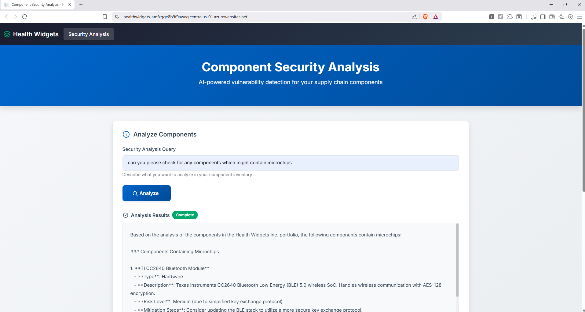
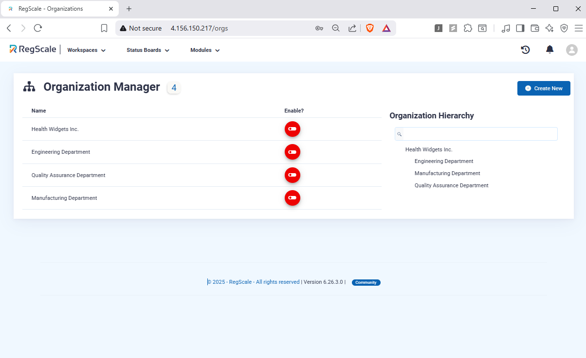
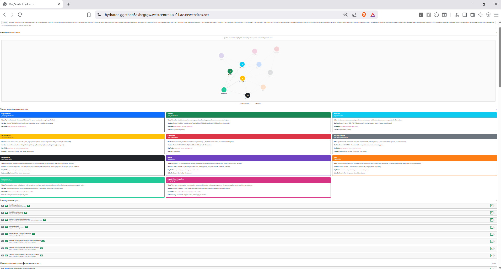
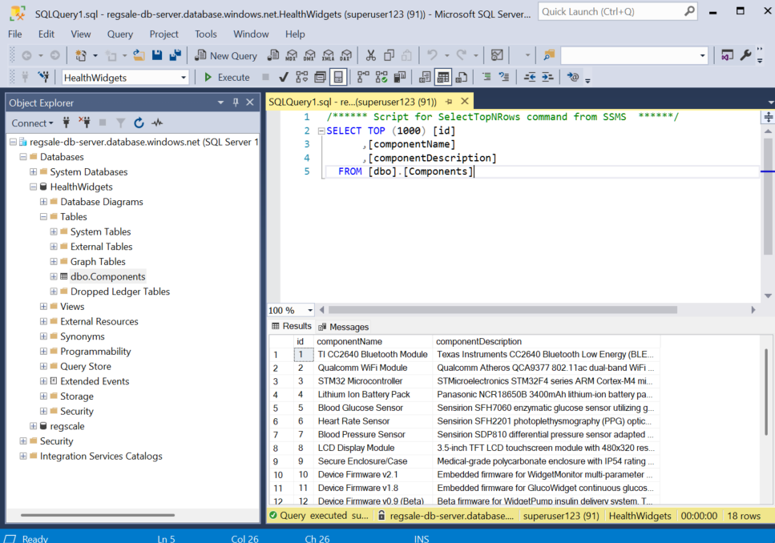

# RegScale Demo Demo

This project was written like a hackathon project. The goal was to create some type of deliverable using:

- RegScale
- LangChain
- MCP
- As many Azure cloud things as possible

The repo is not cleaned up. `.gitignores` are ignored. Organization? What organization.

---

### Health Widgets Security Portal (Azure App Service)

The primary deliverable - a frontend for all the other components.

**URL:** https://healthwidgets-amfzgge8b9f9aweg.centralus-01.azurewebsites.net/

**Source:** [`/HealthWidgets/Website`](https://github.com/smchughinfo/regscale_demo_demo/tree/main/HealthWidgets/Website)



---

### RegScale Installation (Azure Kubernetes Service)

**URL:** http://4.156.150.217
**Username:** `seanmchugh1`
**Password:** `51mpl3Compliance$2`



---

### Hydrator Tool (Azure App Service)

**URL:** https://hydrator-ggctbab8exhcgtgw.westcentralus-01.azurewebsites.net/

**Source:** [`/Hydrator`](https://github.com/smchughinfo/regscale_demo_demo/tree/main/Hydrator)



---

### Database Server (Azure SQL Database)

**Server:** `regsale-db-server.database.windows.net`
**User:** `superuser123`
**Password:** `51mpl3Compliance$2`

**Databases:**
- `regscale` - RegScale GRC database
- `HealthWidgets` - Simulated business component database

**Health Widgets Data:** [`/DemoAnalyzer/component-hydration.sql`](https://github.com/smchughinfo/regscale_demo_demo/blob/main/DemoAnalyzer/component-hydration.sql)



---

### LangChain Component Analyzer (Azure Function App)

**Use:**
```bash
curl -X POST https://health-widgets-analyzer.azurewebsites.net/api/analyze \
    -H "Content-Type: application/json" \
    -d '{"prompt": "can you please check for any components which might contain microchips"}'
```

**Source:** [`/DemoAnalyzer`](https://github.com/smchughinfo/regscale_demo_demo/tree/main/DemoAnalyzer)

---

### MCP (Claude Code)

**Tools**: list screens, take screenshot (of screen)

**Source:** [`/MCP`](https://github.com/smchughinfo/regscale_demo_demo/tree/main/MCP)

---

¯\\_(ツ)_/¯ 


